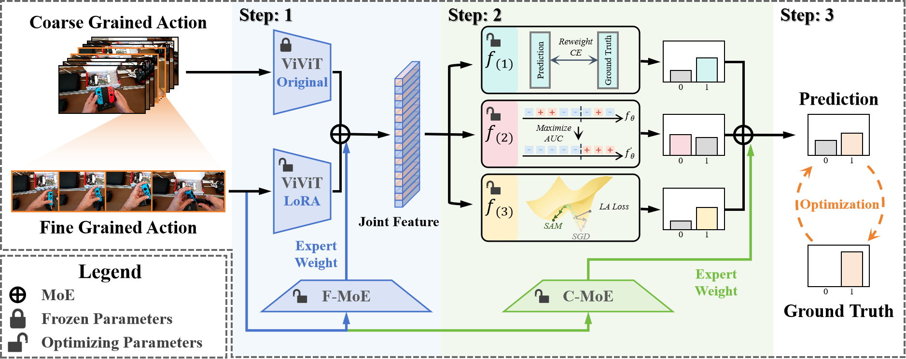

# Dual-Stage Reweighted MoE for Long-Tailed Egocentric Mistake Detection (EgoVis HoloAssist Challenges @ CVPR 2025)

<p align="center">
<a href="https://arxiv.org/pdf/2509.12990">"></a>
<a href="https://www.codabench.org/competitions/2613/#/results-tab"></a>
<a href="" target='_blank'>

</a>
</p>


**Author:** [Boyu Han](https://boyuh.github.io/), [Qianqian Xu*](https://qianqianxu010.github.io/), [Shilong Bao](https://statusrank.github.io/), [Zhiyong Yang](https://joshuaas.github.io/), [Sicong Li](https://github.com/scongl), [Qingming Huang*](https://qmhuang-ucas.github.io/)



## ✨ Updates

[2025-09-16] 🔥 Our technical report has been published.

[2025-06-18] Our team (MR-CAS) won the [1st place](https://www.codabench.org/competitions/2613/#/results-tab) in [CVPR 2025 Competition for Fine-grained Video Understanding (EgoVis HoloAssist Challenges, Mistake Detection Track)](https://egovis.github.io/cvpr25/)!

## 🔜 TODOs

- [ ] Release the codes and pre-training weights of DR-MoE.

## ✒️ Citation

If you find our work inspiring or use our codebase in your research, please cite our work.

```
@article{han2025dual,
  title={Dual-Stage Reweighted MoE for Long-Tailed Egocentric Mistake Detection},
  author={Boyu Han and Qianqian Xu and Shilong Bao and Zhiyong Yang and Sicong Li and Qingming Huang},
  journal={arXiv preprint arXiv:2509.12990},
  year={2025}
}
```

## 💬 Contact

If you find any issues or plan to contribute back bug-fixes, please contact us by Boyu Han (Email: hanboyu23z@ict.ac.cn).
